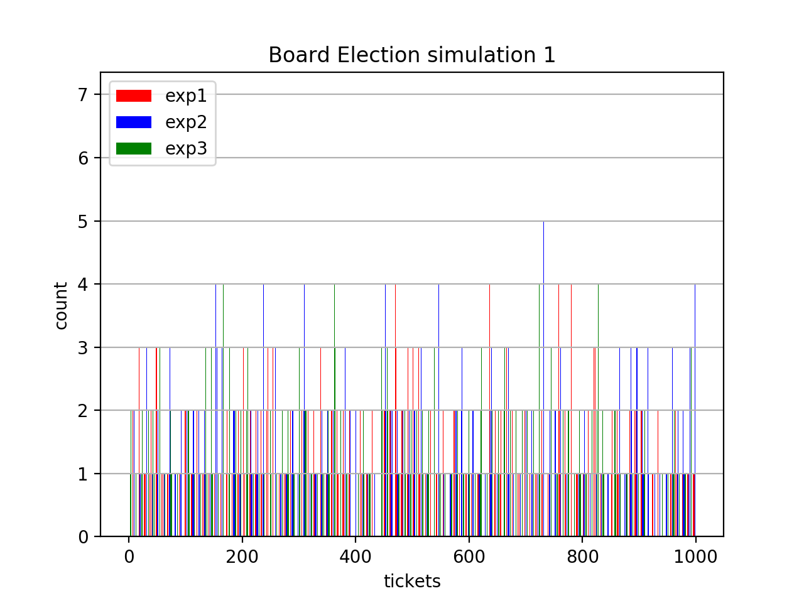
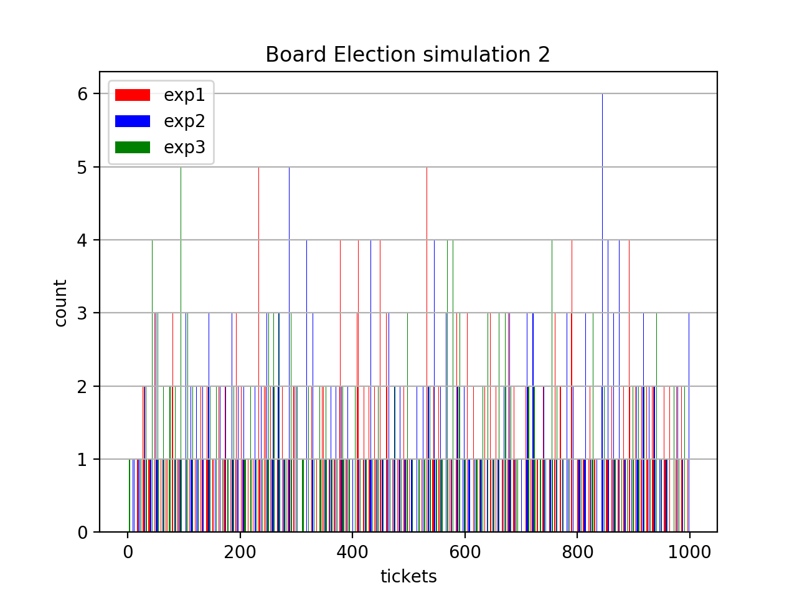
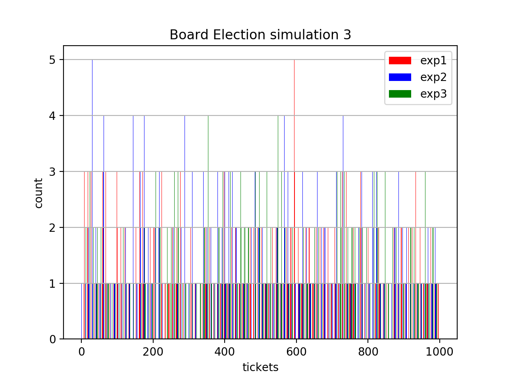
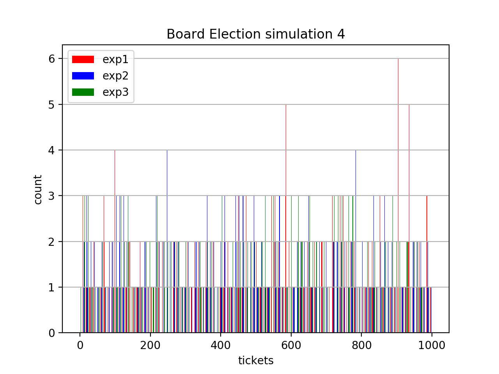
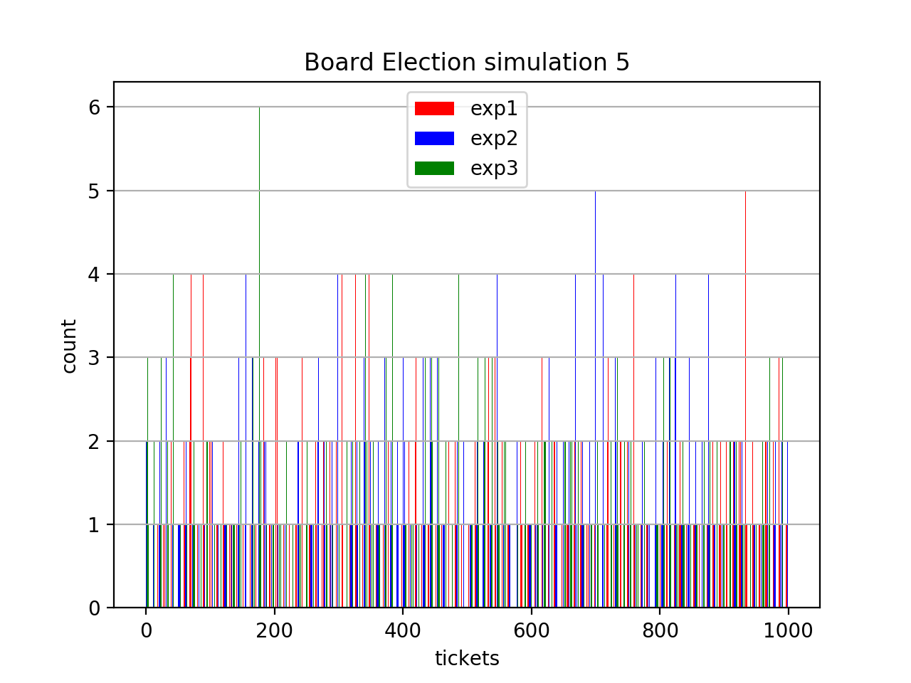
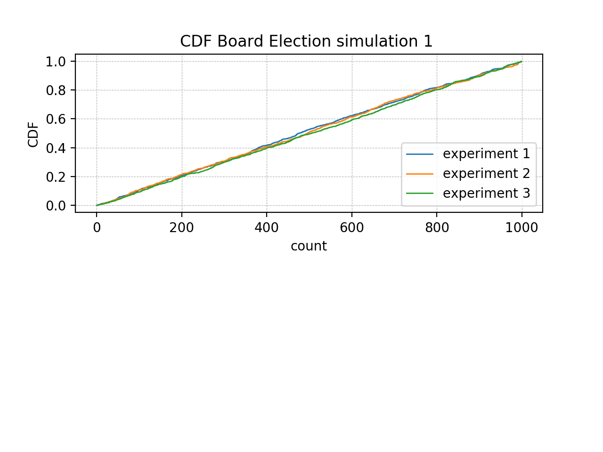
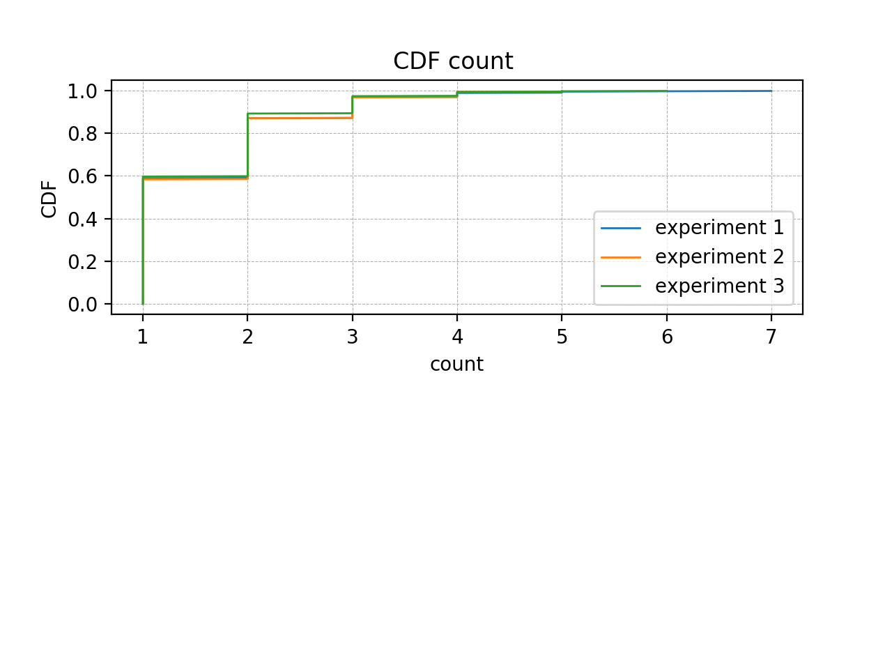

# Board Election

## 1. Environment

Define the common parameters:

ECC of type Secp256k1:

    y^2 = x^3 + 7
    
    P(x1, y1);
    Q(x2, y2);
    

    
     
## 2. Ticket Generator
Define the number of tickets [1...N]

Compute N operation on the ECC to generate the N tickets :

    P + Q = -R => R  [Ticket 1]
    P + R = -E => E  [Ticket 2]
    P + E = -F => F  [Ticket 3]
    ...              [Ticket N]

## 3. Select the Leader

Starting for the hash of the last block that is written into the Blockchain do the following steps:

    1. Starting hash: 4ceb86317d0d4dac6853663589ef02ccb67134cee75bb886a4410b7aedd0e109

    2. Split the hash in 4 parts:
    Part 1: 4ceb86317d0d4dac
    Part 2: 6853663589ef02cc
    Part 3: b67134cee75bb886
    Part 4: a4410b7aedd0e109
    
    3. Transform each part into binary
    Binary Part 1:  0100110011101011100001100011000101111101000011010100110110101100
    Binary Part 2:  0110100001010011011001100011010110001001111011110000001011001100
    Binary Part 3:  1011011001110001001101001100111011100111010110111011100010000110
    Binary Part 4:  1010010001000001000010110111101011101101110100001110000100001001
    
    4. Compute the XOR between [part 1 - part 2] and [part 3 = part 4]
    Partial Result 1: 0010010010111000111000000000010011110100111000100100111101100000
    Partial Result 2: 0001001000110000001111111011010000001010100010110101100110001111
   
    5. Compute the XOR between [partial resutl 1 and partial result 2]
    Final Result    : 0001001000110000001111111011010000001010100010110101100110001111
   
    6. Transform the Binary number into a decimal number and compute the modulo N function
    Winner (Leader): 680
    
Ticket n. 680 is the Leader of the Election. 

## 4. Board Members

We could have several approaches to define the board members. For instance we could run the functions described into point 3 in a deterministic way (like splitting the hash in different parts) or more easily starting from the Leader ticket simple count another m (number of board members) consecutive tickets (ex. 681, 682, ... m-1, m).
The fact that they are consecutive tickets do not matter because they are representing points that are far away one to each other.

## 5. Is the Board Election a pseudorandom generator?

In order to verify that the tickets exctraction is an uniformly distributed event, we made some simulations of the Board Election. In particular, each simulation is composed as follows: there are three independent lotteries, in each of them 1000 tickets are extracted.  We performed five of such simulations for a total of nine independent lotteries. For each simulation we show the corresponding histogram chart. 

The Comulative Density Function (CDF) of a uniform random variable is a line in the plane. We plot the CDF of the tickets, just for the first simulation, since it follows always the same trend even for the other simulations. As expected, it shows a linear trend, with a really narrow error. 

Finally, the CDF of the counts is showed (again just of the first simulation). Over the 80% of tickets have been extracted for a maximum of two consecutive times. 

